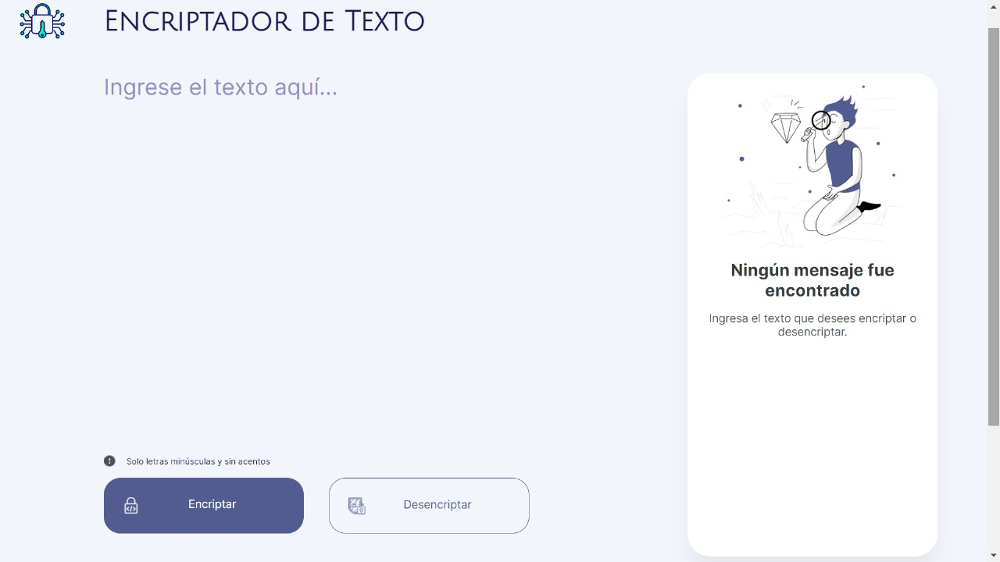
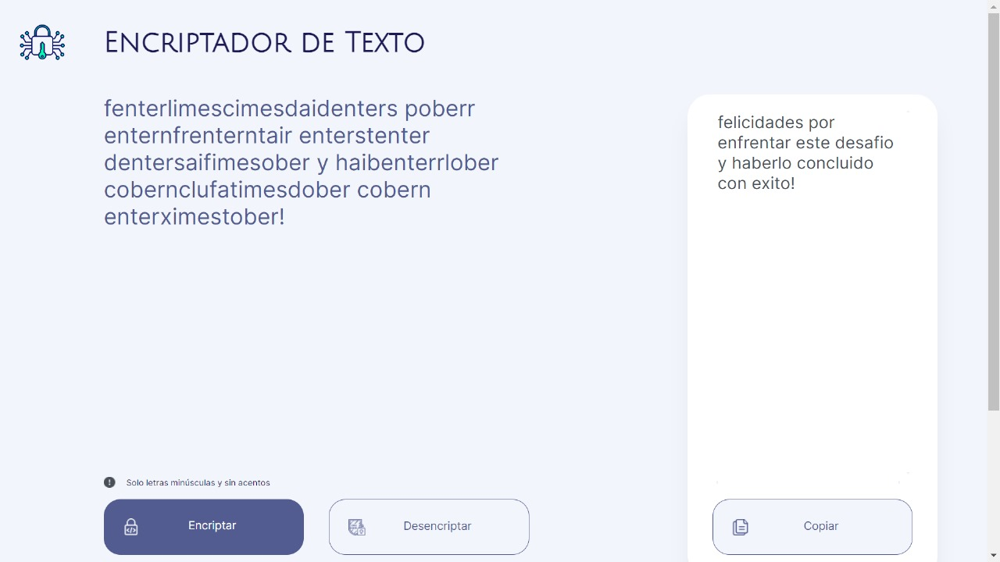

# 🔐 Desafío de Encriptación de Textos - Alura Latam Challenge #1

¡Bienvenidas y bienvenidos a mi solución para el primer desafío de Alura Latam!

He trabajado en una aplicación que encripta textos, permitiendo intercambiar mensajes secretos con otras personas que conozcan la clave de encriptación utilizada.

## 🚀 Descripción del Proyecto

Este proyecto consiste en desarrollar una aplicación web capaz de encriptar y desencriptar mensajes utilizando las siguientes llaves de encriptación:

- La letra "e" es convertida para "enter"
- La letra "i" es convertida para "imes"
- La letra "a" es convertida para "ai"
- La letra "o" es convertida para "ober"
- La letra "u" es convertida para "ufat"

## ✅ Requisitos

1. **Funcionamiento**:
    - La aplicación funciona solo con letras minúsculas.
    - No se utilizan letras con acentos ni caracteres especiales.
    - Es posible convertir una palabra a su versión encriptada y devolver una palabra encriptada a su versión original.

2. **Interfaz de Usuario**:
    - La página tiene campos para la inserción del texto que será encriptado o desencriptado.
    - El usuario puede escoger entre las dos opciones (encriptar o desencriptar).
    - El resultado se muestra en la pantalla.

3. **Funcionalidad Extra**:
    - Un botón que copia el texto encriptado/desencriptado al portapapeles, con la misma funcionalidad de Ctrl+C o la opción "copiar" del menú de las aplicaciones.

## 🌟 Ejemplos

- **Encriptar**:
    - "gato" => "gaitober"
- **Desencriptar**:
    - "gaitober" => "gato"

## 📷 Captura de Pantalla

## 🛠️ Tecnologías Utilizadas

- HTML
- CSS
- JavaScript

## 📖 Instrucciones de Uso en local

1. Clona este repositorio: `git clone https://github.com/JuanC046/encriptador-texto.git`
2. Abre el archivo `index.html` en tu navegador.
3. Escribe el texto que deseas encriptar o desencriptar en el campo correspondiente.
4. Selecciona la opción (Encriptar/Desencriptar).
5. Haz clic en el botón para ver el resultado.
6. (Opcional) Usa el botón de copiar para copiar el resultado al portapapeles.

## 📖 Instrucciones de Uso en la Web

1. Accede a través del siguiente enlace:  [Encriptador de Texto](https://juanc046.github.io/encriptador-texto/)
3. Escribe el texto que deseas encriptar o desencriptar en el campo correspondiente.
4. Selecciona la opción (Encriptar/Desencriptar).
5. Haz clic en el botón para ver el resultado.
6. (Opcional) Usa el botón de copiar para copiar el resultado al portapapeles.

## 🤝 Contribuciones

¡Las contribuciones son bienvenidas! Si deseas contribuir, por favor sigue los siguientes pasos:

1. Haz un fork del proyecto.
2. Crea una rama nueva (`git checkout -b feature/nueva-característica`).
3. Realiza tus cambios y haz commit (`git commit -m 'Agrega una nueva característica'`).
4. Haz push a la rama (`git push origin feature/nueva-característica`).
5. Abre un Pull Request.

## 📄 Licencia

Este proyecto está bajo la licencia MIT. Consulta el archivo [LICENSE](LICENSE) para obtener más detalles.

---

¡Gracias por revisar mi solución para este desafío de Alura Latam y Oracle One! ¡Espero que les guste!
